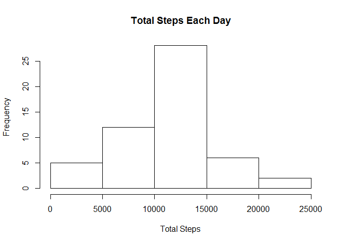
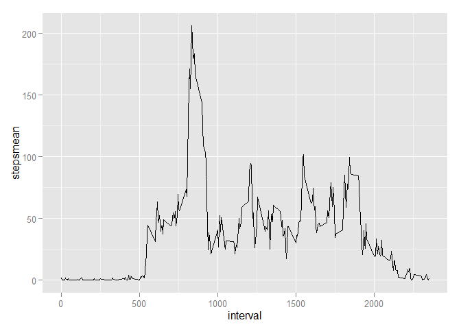
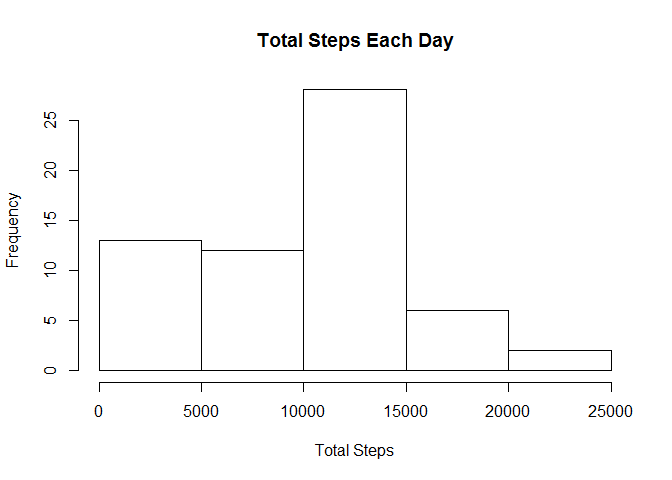
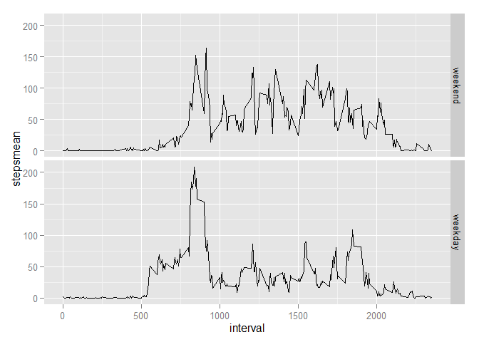

# Reproducible Research: Peer Assessment 1
## Setting Global Options

```r
library(knitr)
opts_chunk$set(echo=TRUE,message=FALSE,warning=FALSE)
```
## Loading and preprocessing the data

```r
Data<-read.csv("activity.csv",na.strings = "NA")
```
## What is mean total number of steps taken per day?

```r
library(dplyr)
DataTotal<-Data%>%group_by(date)%>%summarize(stepsTotal=sum(steps,na.rm=FALSE))
hist(DataTotal$stepsTotal,main="Total Steps Each Day",xlab="Total Steps")
```

 

```r
DataTotalMean<-mean(DataTotal$stepsTotal,na.rm=TRUE)
DataTotalMedian<-median(DataTotal$stepsTotal,na.rm=TRUE)
```
The mean of the total number of steps taken per day is:

10766

The median of the total number of steps taken per day is:  

10765

## What is the average daily activity pattern?
1. Make a time series plot of the 5-minute interval (x-axis) and the average number of steps taken, averaged across all days (y-axis)

```r
DataMean<-Data%>%group_by(interval)%>%summarize(stepsmean=mean(steps,na.rm=TRUE))
library(ggplot2)
g<-ggplot(DataMean,aes(interval,stepsmean))+geom_line(size=0.5)
g
```

 

2. Which 5-minute interval, on average across all the days in the dataset, contains the maximum number of steps?

```r
IntervalMaxStep<-DataMean[which(DataMean$stepsmean==max(DataMean$stepsmean)),"interval"]
```
The interval that contains the maximum number of step is: 

835.

## Imputing missing values
1. Calculate and report the total number of missing values in the dataset

```r
NumberMissing<-sum(is.na(Data$steps))
```
The number of missing values is: 

2304

2. Devise a strategy for filling in all of the missing values in the dataset. The strategy does not need to be sophisticated. For example, you could use the mean/median for that day, or the mean for that 5-minute interval, etc.
3. Create a new dataset that is equal to the original dataset but with the missing data filled in.

```r
Data<-Data%>%mutate(WeekDay=weekdays(as.Date(date)))
Data<-Data%>%group_by(WeekDay,interval)%>%mutate(stepsMedian=as.numeric(median(steps,na.rm=TRUE)))
naInd<-which(is.na(Data$steps))
DataImputed<-Data
DataImputed[naInd,"steps"]<-DataImputed[naInd,"stepsMedian"]
```
The strategy used for imputing the missing value is to take the median of values with same interval and same weekday. Firstly a new data on the weekday of the date is added. Secondly the medain of the steps on each interval on each weekday is calculated. Lastly the steps with the missing value is replaced with above median value.  

4. Make a histogram of the total number of steps taken each day and Calculate and report the mean and median total number of steps taken per day. Do these values differ from the estimates from the first part of the assignment? What is the impact of imputing missing data on the estimates of the total daily number of steps?

```r
DataImputedTotal<-DataImputed%>%group_by(date)%>%summarize(stepsTotal=sum(steps,na.rm=FALSE))
hist(DataImputedTotal$stepsTotal,main="Total Steps Each Day",xlab="Total Steps")
```

 

```r
DataImputedTotalMean<-mean(DataImputedTotal$stepsTotal,na.rm=TRUE)
DataImputedTotalMedian<-median(DataImputedTotal$stepsTotal,na.rm=TRUE)
```
The mean of the total number of steps taken per day is:

9705

The median of the total number of steps taken per day is:  

10395

The mean and median total number of steps taken per day after imputing the missing data are 9705 and 10395 respectively, while the mean and median of the original data are 10766 and 10765. The values are different after imputing the missing data. Further, the data shows that the mean and median values are lower after imputing the missing data. 

## Are there differences in activity patterns between weekdays and weekends?
1.Create a new factor variable in the dataset with two levels - "weekday" and "weekend" indicating whether a given date is a weekday or weekend day

```r
weekdays1 <- c('Monday', 'Tuesday', 'Wednesday', 'Thursday', 'Friday')
DataImputed$wDay<-factor((DataImputed$WeekDay%in% weekdays1), 
                              levels=c(FALSE, TRUE), labels=c('weekend', 'weekday'))
```
2.Make a panel plot containing a time series plot of the 5-minute interval (x-axis) and the average number of steps taken, averaged across all weekday days or weekend days (y-axis)

```r
DataImputedMean<-DataImputed%>%group_by(wDay,interval)%>%summarize(stepsmean=mean(steps,na.rm=TRUE))
g<-ggplot(DataImputedMean,aes(interval,stepsmean))
g+geom_line(size=0.5)+facet_grid(wDay~.)
```

 
